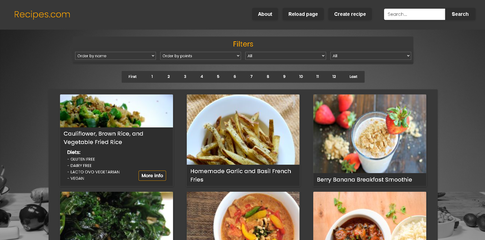
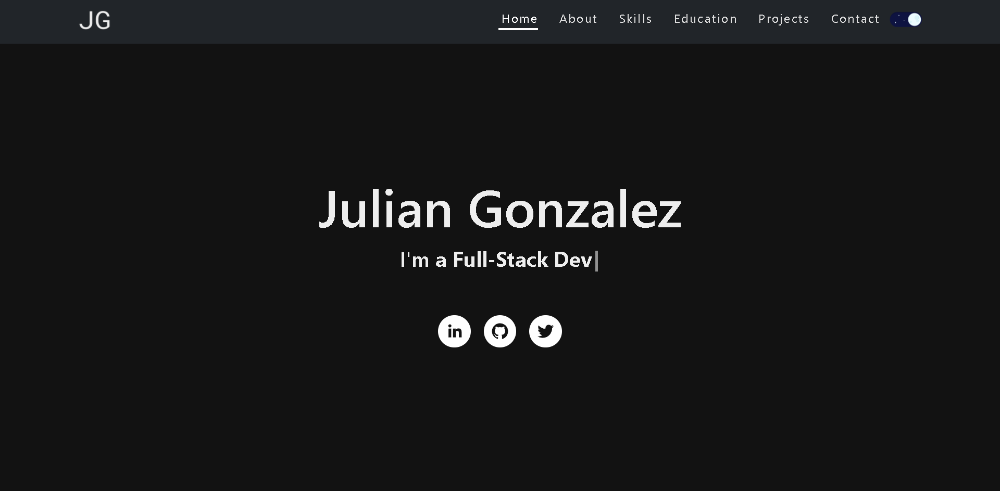
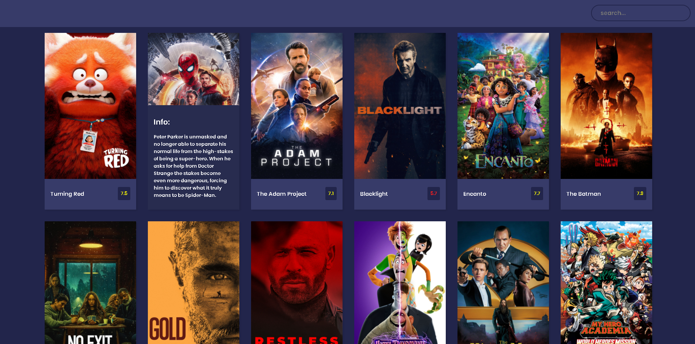
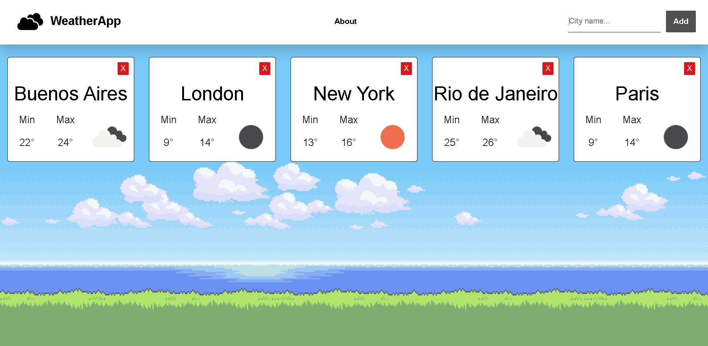

  # Hi there! I'm Julián 👋

   <p >I am a computer technician & full-stack, front-end oriented developer who's trying to find his way in the IT world.</p>
   <p> If you are interested in my work send me a message!.</p>

[](https://www.linkedin.com/in/juliangonzalezdev/)
[](mailto:julianmarcos505@gmail.com)
   
   ## About me
   ```js
const Julian Gonzalez = {
  Skills: {
        FrontEnd: ['JavaScript', 'TypeScript', 'React, 'Redux', 'HTML', 'CSS', 'Bootstrap'],
        BackEnd: ['NodeJs', 'Express', 'Sequelize', 'PostgreSQL', 'MongoDB'],
        Others: ['Git', 'Figma', 'PGAdmin4', 'Postman']
        },
  Interests: ['AI', 'CloudComputing', 'IOT', 'MachineLearning'],
  Challenge: 'Finish Henry's bootcamp and find a tech job opportunity.'
}
```

## Projects

### Recipes.com
<p align='center'>
<a align='center' href="https://recipes-page-p07scdq0p-xjuliang.vercel.app/">
 
</a>

- Individual project for Henry bootcamp.
- Food page project which uses data from the SpoonacularApi.
- Form for create a recipe, update, delete, filters and search bar.

This was my first full-stack project, and thanks to it I was able to learn how the front-end and the back-end are connected. I also learned to work with databases and how to do deployment.

<b>Technologies:</b> React, Redux, NodeJs, Express, Sequelize, Heroku.

[](https://github.com/xjuliang/PI-Food-Main)
[](https://recipes-page-p07scdq0p-xjuliang.vercel.app/)

<hr>

### Personal Portfolio

<p align='center'>     
   <a align='center' href="https://julian-gonzalez-portfolio.vercel.app/">
        
    </a>
    
- Portfolio Website made in React
- Info about me and my projects.
- Dark Mode Support & Responsive

Thanks to this project I was able to improve my knowledge in React and CSS, as well as learn to use some new cool libraries. 

<b>Technologies:</b> React, React-Bootstrap, CSS.

[](https://github.com/xjuliang/Julian-Gonzalez-Portfolio)
[](https://julian-gonzalez-portfolio.vercel.app/)
    
</p>

<hr>

### Cinema Catalogue

<p align='center'>     
   <a align='center' href="https://xjuliang.github.io/Cinema-Catalogue/">
        
    </a>
    
- Info about the latests movies.
- Search your favourite movies.  
- Consumes information from the CinemaAPI.

I created this project in order to improve my React skills.
 
<b>Technologies:</b> React, CSS.
    
[](https://github.com/xjuliang/Cinema-Catalogue)
[](https://xjuliang.github.io/Cinema-Catalogue)
</p>

<hr>

### Weather Page

<p align='center'>     
   <a align='center' href="https://weather-page-4f8ys22g8-xjuliang.vercel.app/">
        
    </a>
    
- Info about the weather of the cities you search.
- Consumes information from the WeatherAPI. 

This is my first React project, thanks to it I learned the basics of the framework.

<b>Technologies:</b> React, CSS.
    
[](https://github.com/xjuliang/Weather-Page)
[](https://weather-page-4f8ys22g8-xjuliang.vercel.app/)
</p>

<hr>

In case you want to see more projects, check my portfolio!     [](https://julian-gonzalez-portfolio.vercel.app/) 